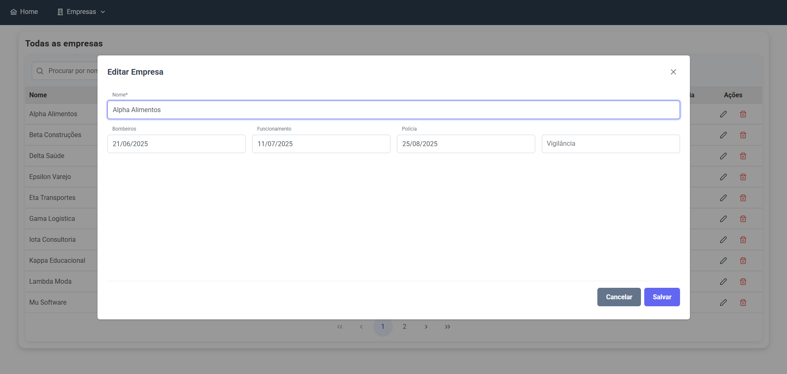

# 🏢 Alvará Monitor: Gestão Inteligente de Vencimentos

<p align="center">
  
  
</p>

<p align="center">
  <a href="https://demo-monitoramento-alvara.vercel.app/" target="_blank">
    
  </a>
</p>

> Solução frontend desenvolvida para automatizar e gerenciar o vencimento de alvarás para um escritório de contabilidade, onde o controle de vencimentos de alvarás era um processo manual e sujeito a erros.

> Esta é uma aplicação full-stack em produção. A versão de produção se conecta a uma API Java com processamento de tarefas assíncrono (RabbitMQ) e a um banco de dados PostgreSQL hospedados na nuvem. Para uma experiência rápida de portfólio, uma versão de demonstração com dados mockados também está disponível.

> **⚠️ Atenção:** A demonstração online acima roda com **dados mockados** para uma experiência de portfólio rápida e acessível. O código-fonte, no entanto, está **totalmente integrado a uma API backend** e pode ser executado em modo de desenvolvimento real.

**🚀 Acesse a demonstração ao vivo do projeto aqui: [demo-monitoramento-alvara.vercel.app](https://demo-monitoramento-alvara.vercel.app/)**

> ℹ️ **Credenciais para Demonstração:**
> > **Login:** `admin`
> > **Senha:** `123`
---

### 💡 Sobre o Projeto

Este projeto nasceu de uma necessidade real identificada em um escritório de contabilidade. O controle de vencimentos de alvarás de múltiplos clientes era um processo manual, sujeito a erros e que consumia um tempo precioso.

O **Monitoramento de Alvarás** foi idealizado como uma solução moderna para centralizar essas informações, fornecer visibilidade clara sobre os próximos vencimentos através de um dashboard intuitivo e automatizar os lembretes, garantindo que nenhum prazo seja perdido.

É uma solução full-stack moderna. Este repositório contém o **Frontend**, construído com Angular para ser uma interface rápida, reativa e responsiva, que consome os dados de uma [API backend dedicada desenvolvida em Java/Spring Boot](https://github.com/lucxsduarte/alvara-monitor).

---

### 📷 Projeto em Ação

| Dashboard Principal | Gerenciamento de Empresas | Cadastro | Edição em Modal |
| :---: | :---: | :---: | :---: |
|  |  |  |  |

---

### ✨ Funcionalidades e Arquitetura

- **Integração com API REST:** Consumo de uma API backend para todas as operações de CRUD (Create, Read, Update, Delete) de empresas.
- **Autorização Baseada em Perfil (Role):** Uso de guardas de rota (`CanActivate`) que verificam a permissão do usuário (`ROLE_ADMIN`) para proteger o acesso a áreas administrativas.
- **Autenticação Real com JWT:** Fluxo completo de login que se comunica com o backend, recebe um JSON Web Token, o armazena e o utiliza para autenticar requisições futuras.
- **`HttpInterceptor` para Tokens:** Anexa automaticamente o token `Bearer` a todas as chamadas para endpoints protegidos da API.
- **Filtragem Reativa no Lado do Servidor:** A busca por nome e os filtros de status (ex: alvarás vencidos) são processados pelo backend, garantindo alta performance e escalabilidade.
- **Dashboard Otimizado:** O dashboard faz uma única chamada a um endpoint de resumo (`/api/dashboard/summary`) que entrega todos os KPIs já calculados, minimizando o tráfego de rede.
- **Design Responsivo:** Experiência de uso consistente em desktops, tablets e celulares.
- **Componentização e Reatividade:** Uso de componentes `standalone`, `DynamicDialog` do PrimeNG para modais e RxJS para gerenciar fluxos de dados de forma reativa e eficiente.
- **Arquitetura Flexível (Mock/Real):** Capacidade de rodar com dados mockados (para portfólio) ou conectado a uma API real, controlado por ambientes do Angular.
- **Testes de Unidade e Componente:** Cobertura de testes com Karma e Jasmine para garantir a qualidade e a confiabilidade dos serviços e componentes principais.

---

### 🛠️ Tecnologias Utilizadas

* **Angular (v17):** Framework principal com arquitetura de componentes Standalone.
* **TypeScript:**
* **PrimeNG & PrimeFlex**
* **RxJS:** 
* **SCSS:**
  
---

### 🚀 Como Executar o Projeto

Este projeto pode ser executado em dois modos distintos:

#### Modo 1: Demonstração (com Dados Mockados)
Ideal para uma visualização rápida do frontend sem a necessidade de um backend.

```bash
# 1. Clone o repositório
git clone [https://github.com/lucxsduarte/alvara-monitor-web.git](https://github.com/lucxsduarte/alvara-monitor-web.git)

# 2. Acesse o diretório
cd alvara-monitor-web

# 3. Instale as dependências
npm install

# 4. Inicie o servidor com a configuração de mock
ng serve --configuration mock
```

#### Modo 2: Desenvolvimento (Conectado à API Real)
Para testar a integração completa.

**Pré-requisito:** A [API backend](https://github.com/lucxsduarte/alvara-monitor) deve estar em execução na sua máquina (`localhost:8080`).

```bash
# Siga os passos 1 a 3 acima, e depois execute:
ng serve
```

---

### 📄 Licença

Este projeto está licenciado sob os termos da Licença MIT.
