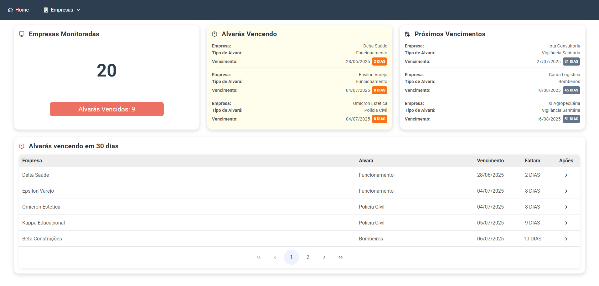
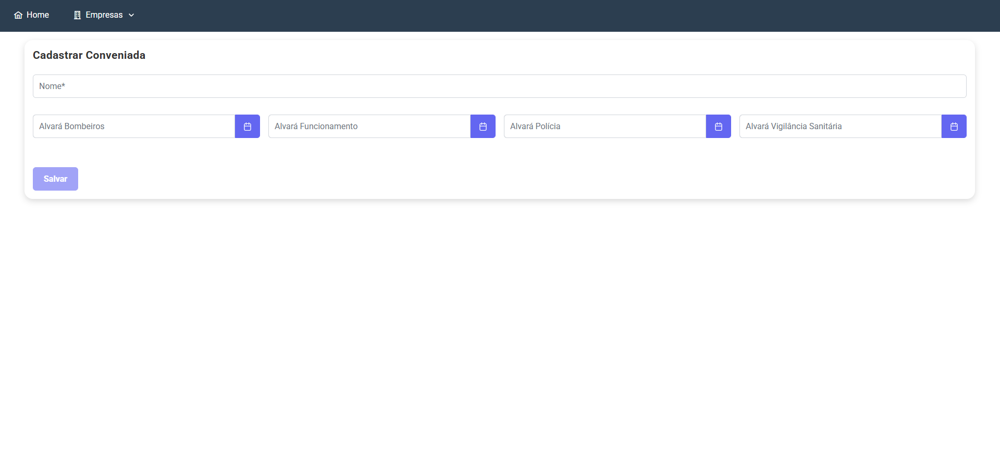

# 🏢 Alvará Monitor: Gestão Inteligente de Vencimentos 🏢


> Solução frontend desenvolvida para automatizar e gerenciar o vencimento de alvarás para um escritório de contabilidade, resolvendo uma necessidade real de negócio.

**⚠️ Atenção:** Esta é uma versão de demonstração (portfólio) que opera com dados 100% mockados. Nenhuma informação real é necessária ou armazenada.

---

### 💡 Sobre o Projeto

Este projeto nasceu de uma necessidade real identificada em um escritório de contabilidade. O controle de vencimentos de alvarás de múltiplos clientes era um processo manual, sujeito a erros e que consumia um tempo precioso.

O **Monitoramento de Alvarás** foi idealizado como uma solução moderna para centralizar essas informações, fornecer visibilidade clara sobre os próximos vencimentos através de um dashboard intuitivo e automatizar os lembretes, garantindo que nenhum prazo seja perdido.

Esta versão do projeto representa o **frontend completo** da aplicação, construído com as mais recentes tecnologias do ecossistema Angular para ser rápido, reativo e responsivo.

---

### 📷 Projeto em Ação

| Dashboard Principal | Gerenciamento de Empresas | Edição em Modal (GIF) |
| :---: | :---: | :---: |
|  |  |  |

---

### ✨ Funcionalidades Implementadas

- **Dashboard Interativo:** Visão geral com indicadores de alvarás vencidos, a vencer em 30 dias e próximos vencimentos.
- **Gerenciamento Completo (CRUD):** Cadastro, leitura, atualização e exclusão de empresas e seus respectivos alvarás.
- **Busca e Filtragem:** Ferramentas para encontrar rapidamente empresas na base de dados.
- **Design Responsivo:** Experiência de uso consistente em desktops, tablets e celulares.
- **Autenticação Simulada:** Fluxo de login/logout com guarda de rotas para proteger o acesso ao sistema.
- **Feedback ao Usuário:** Notificações em tempo real para todas as ações importantes.

---

### 🛠️ Tecnologias Utilizadas

* **Angular (v17):** Framework principal com arquitetura de componentes Standalone.
* **TypeScript:** Superset do JavaScript que adiciona tipagem estática.
* **PrimeNG:** Robusta biblioteca de componentes de UI para uma interface rica e profissional.
* **RxJS:** Para gerenciamento de estado e fluxos de dados de forma reativa.
* **SCSS:** Pré-processador CSS para uma estilização mais organizada e poderosa.
* **PrimeFlex:** Grid CSS e utilitários para criar layouts responsivos.

---

### 🚀 Como Executar a Versão de Demonstração

Para explorar o projeto em sua máquina, siga os passos abaixo.

```bash
# 1. Clone o repositório
git clone [https://github.com/](https://github.com/)[SeuUsuario]/alvara-monitor-web.git

# 2. Acesse o diretório
cd alvara-monitor-web

# 3. Instale as dependências
npm install

# 4. Inicie o servidor de desenvolvimento com os dados mockados
# A aplicação estará disponível em http://localhost:4200
ng serve --configuration mock
```

---

### 🎯 Próximos Passos (Roadmap)

Este projeto continua em desenvolvimento. Os próximos passos planejados são:

- [ ] **Integração com Backend:** Conectar o frontend com a API real em Java para persistência dos dados.
- [ ] **Notificações por Email:** Implementar um serviço de envio de emails para alertar sobre vencimentos próximos.
- [ ] **Perfis de Usuário:** Diferenciar permissões entre administradores e usuários comuns.
- [ ] **Melhorias de UI/UX:** Refinar a experiência do usuário com base em feedbacks.

---

### 📄 Licença

Este projeto está licenciado sob os termos da Licença MIT.
